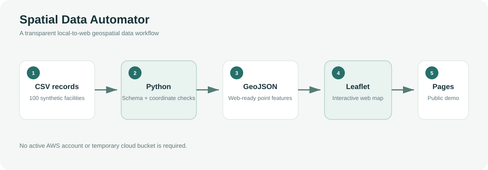

# Spatial Data Automator

A reproducible Python and Web GIS project that converts synthetic Texas energy
infrastructure records from CSV to GeoJSON and displays the result in an
interactive Leaflet map.

**Live demo:** https://saliprued.github.io/spatial-data-automator/



## Project description

Web maps commonly receive location data in GeoJSON, while operational datasets
often arrive as tables. This project demonstrates a small, transparent workflow
for validating coordinate fields, creating GeoJSON point features, and publishing
the result in a browser-based map. it demonstrates a working local-to-web spatial data workflow,
and does not claim an active AWS Lambda or real-time cloud deployment. A serverless S3/Lambda
version could be added later as a separate deployment extension.


## Features

- Converts 100 synthetic facility records from CSV to GeoJSON.
- Checks required columns and validates latitude/longitude ranges.
- Produces a standards-based GeoJSON `FeatureCollection`.
- Loads the generated file directly from the repository, avoiding temporary cloud dependencies.
- Styles facilities by type and distinguishes Active, Maintenance, and Inactive records.
- Provides interactive popups with facility, operator, status, and identifier fields.
- Adapts the map interface for desktop and mobile screens.

## Tools

- Python 3 standard library (`csv`, `json`, `argparse`, `pathlib`)
- GeoJSON
- JavaScript
- Leaflet
- HTML and CSS

## View the map locally

See the directory through a small local web server:

```bash
python -m http.server 8000
```

Then open `http://localhost:8000`.

## Disclaimer

The Texas energy infrastructure records are synthetic and were created only for
software and portfolio demonstration. They must not be interpreted as current or
operational infrastructure information.


## Author

Sandra L. Perez  
Geospatial Data | Spatial Analytics | Cloud & Application Development
